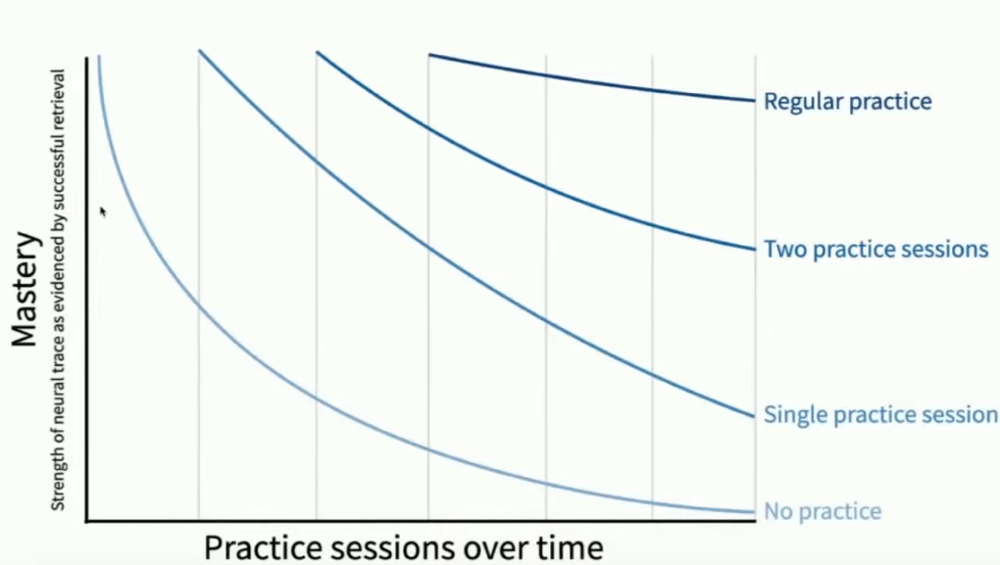
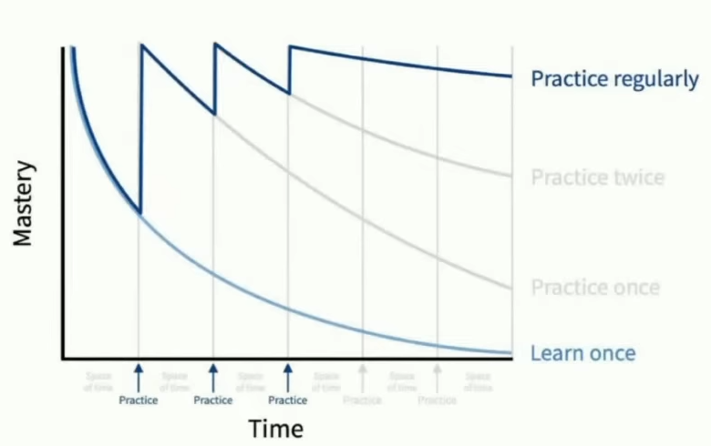
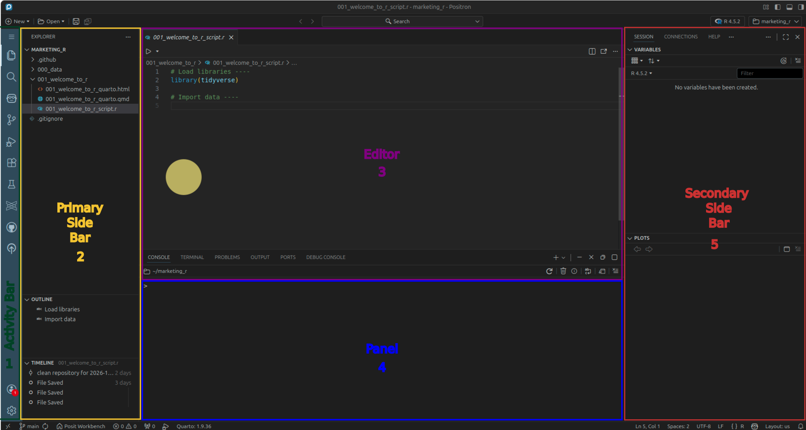

```{r}
#| label: libraries

```

```{r}
#| label: palette

umng_palette <- c(
  "#043074",
  "#fdc600",
  "#0d5e30",
  "#ee2a24",
  "#fc6700",
  "#00b3f0",
  "#6e3c1a",
  "#f8941c",
  "#8e44ad",
  "#2c3e50",
  "#16a085",
  "#c0392b",
  "#e91e63"
)
```

# Please Read Me

##

-   This presentation is based on [@chapman_r_2019, Chapter 1]

## 

- **Purpose**

    - Deliver essential knowledge within a minimal timeframe by employing hands-on learning techniques to enhance productivity in the R programming language
    
# Forgetting curves

## 

-   **Learning and forgetting curves** [@posit_pbc_learning_2023]

{.nostretch #fig-learning-and-forgetting-curves width=70% fig-align="center"}

## 

-   **Practicing and forgetting curves** [@posit_pbc_learning_2023]

{.nostretch #fig-practicing-and-forgetting-curves width=70% fig-align="center"}

# Data Science

##

![The data science venn diagram [@conway_data_2013]](../000_images/002_data_science_venn_diagram.png){.nostretch #fig-data-science-venn-diagram width=50%}

# Posit Workbench

##

Unites the most popular Integrated Development Environments - IDE for data science in one secure environment:

- Positron
- RStudio
- Visual Studio Code
- Jupyter (NoteBook and Lab)

# R, Positron Pro and Quarto

## 

-   **What are R and Positron Pro?** [@ismay_statistical_2025, Chapter 1]

::: {#fig-r_vs_rstudio_ide_1 layout-ncol="2"}
{#fig-r-1 width=100%}

{#fig-positron-pro-1 width=100%}

Analogy of difference between R and Positron Pro
:::

## 

-   **What is Quarto?**

    -   Open-source scientific and technical publishing system
    -   It is possible to integrate prose, code and results via Positron Pro [@wickham_r_2023, Chapter 29]

{.nostretch #fig-quarto width=100% fig-align="center"}

## {.smaller} 

-   **Using R and Quarto via Positron Pro** [@ismay_statistical_2020, Chapter 1]

    -   Don't worry about Quarto because it will be embedded in Positron Pro

::: {#fig-r_vs_positron_pro_2 layout-ncol="2"}
{#fig-r-2 width=70%}

{#fig-rstudio-ide-2 width=55%}

R versus Positron Pro
:::

##

{#fig-positron-layout width=55%}

# R packages

## 

-   **What are R packages?** [@ismay_statistical_2025, Chapter 1]

::: {#fig-r_packages layout-ncol="2"}
{#fig-package-base width=65%}

{#fig-package width=90%}

Analogy of R vs R packages
:::

## {.smaller}

-   **Installing the tidyverse as an example**

    -   Copy and paste this code in the console. The tidyverse package is already installed in your session so nothing will happen but if you don't have installed the tidyverse then the package is going to be installed

    -   Installing a package is like downloading an app from a store where you need to do it only once

```{r}
#| eval: false
#| echo: true

packages <- c("tidyverse")
for (package in packages) {
  if (!(package %in% rownames(installed.packages()))) {
    install.packages(package)
  }
}
```

-   **Loading a package**

    -   Loading a package is like opening an app you already installed on your phone where you need to do it every time you want to use the app

```{r}
#| eval: false
#| echo: true

library(tidyverse)
```

# Please help me: Errors, warnings, and messages

## 

-   **Error**: Generally when there's an error, the code will not run and a message will try to explain what went wrong [@ismay_statistical_2025, Chapter 1]

```{r}
#| error: true
#| echo: true

x <- c(1, 2, 3, 4, 5)
X
```

-   **Warning**: Generally your code will still work, but with some caveats [@ismay_statistical_2025, Chapter 1]

```{r}
#| warning: true
#| echo: true

sqrt(-9)
```

## {.smaller}

-   **Message**: it's just a friendly message [@ismay_statistical_2025, Chapter 1]

    -   Read it, wave back at R, and thank it for talking to you [@ismay_statistical_2025, Chapter 1]

```{r}
#| message: true
#| echo: true
packages <- c("tidyverse")
for (package in packages) {
  if (!(package %in% rownames(installed.packages()))) {
    install.packages(package)
  }
}
library(tidyverse)
```

# R for Marketing Research and Analytics, 2nd Ed

## 

-   **Download from UMNG Springer Link database**:

    -   <https://doi-org.ezproxy.umng.edu.co/10.1007/978-3-030-14316-9>

-   **Check the book site**:

    -   <http://r-marketing.r-forge.r-project.org>

# Acknowledgments

##

-   To my family that supports me

-   To the taxpayers of Colombia and the [**UMNG students**](https://www.umng.edu.co/estudiante) who pay my salary

-   To the [**Business Science**](https://www.business-science.io/) and [**R4DS Online Learning**](https://www.rfordatasci.com/) communities where I learn [**R**](https://www.r-project.org/about.html) and [**$\pi$-thon**](https://www.python.org/about/)

-   To the [**R Core Team**](https://www.r-project.org/contributors.html), the creators of [**Positron**](https://positron.posit.co/), [**Quarto**](https://quarto.org/) and the authors and maintainers of the packages [**tidyverse**](https://CRAN.R-project.org/package=tidyverse) and [**tinytex**](https://CRAN.R-project.org/package=tinytex) for allowing me to access these tools without paying for a license

# References {.allowframebreaks}